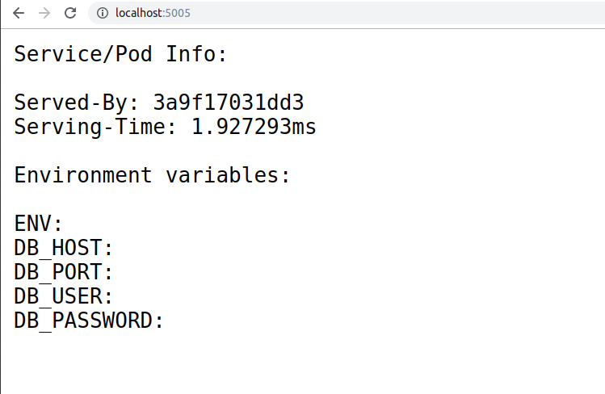

# Kubernetes 12-Factor Demo [Under Construction]

**This is on progress work. Estimated will be finished on Monday November 4th, 2019**

## Build Yourself (optional)

If you just want to run the container, you can skip to "Run Container" part.

### Build go app for linux

Prerequisite: you have Golang installed on your local machine. For Ubuntu, you can follow this article: https://medium.com/better-programming/install-go-1-11-on-ubuntu-18-04-16-04-lts-8c098c503c5f

Navigate to root project folder, and run this command:

``` sh
CGO_ENABLED=0 GOOS=linux go build -a -installsuffix cgo -ldflags '-w' -o web ./main.go
```

### Build/push container

``` sh
sudo docker build -t asatrya/k8s-12-factor-demo .
sudo docker push asatrya/k8s-12-factor-demo
```

## Run Container Locally

This is the docker image: https://hub.docker.com/r/asatrya/k8s-12-factor-demo

To run container on port 5005, execute this command:

``` sh
sudo docker run -p 5005:5005 --rm asatrya/k8s-12-factor-demo
```

Access http://localhost:5005/ on your browser, then it will show a simple screen displaying hostname and environment variable like this



## Deploy on Kubernetes Cluster

Prerequisite: you have succesfully connect your `kubectl` client with your cluster. Make sure this is working well by running 

``` sh
kubectl get nodes
```

it should display list of nodes in your cluster.

To deploy your container to Kubernetes cluster, run this command:

``` sh
kubectl -f kubernetes/demo-configmap.yaml apply
kubectl -f kubernetes/demo-secret.yaml apply
kubectl -f kubernetes/demo-deployment.yaml apply
kubectl -f kubernetes/demo-service.yaml apply
```

## Resize Cluster (GCP)

``` sh
gcloud container clusters resize standard-cluster-1 --node-pool default-pool --num-nodes 0
```

## Where is The 12-Factor?

### I. One Codebase

One codebase tracked in revision control, many deploys

### II. Dependencies

Explicitly declare and isolate dependencies

### III. Config

Store config in the environment

*To be described*

